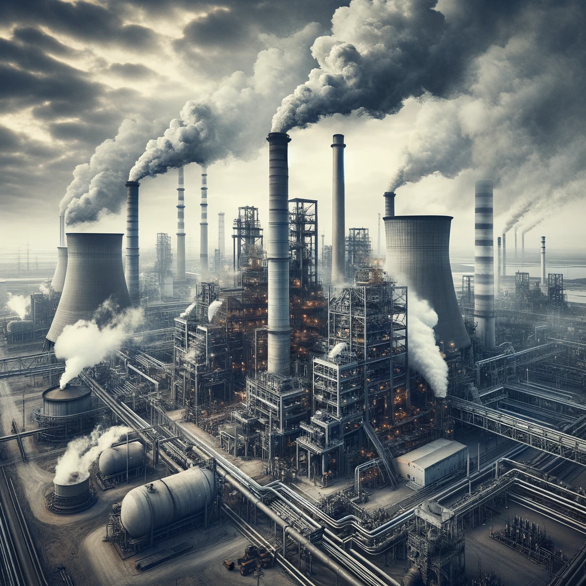
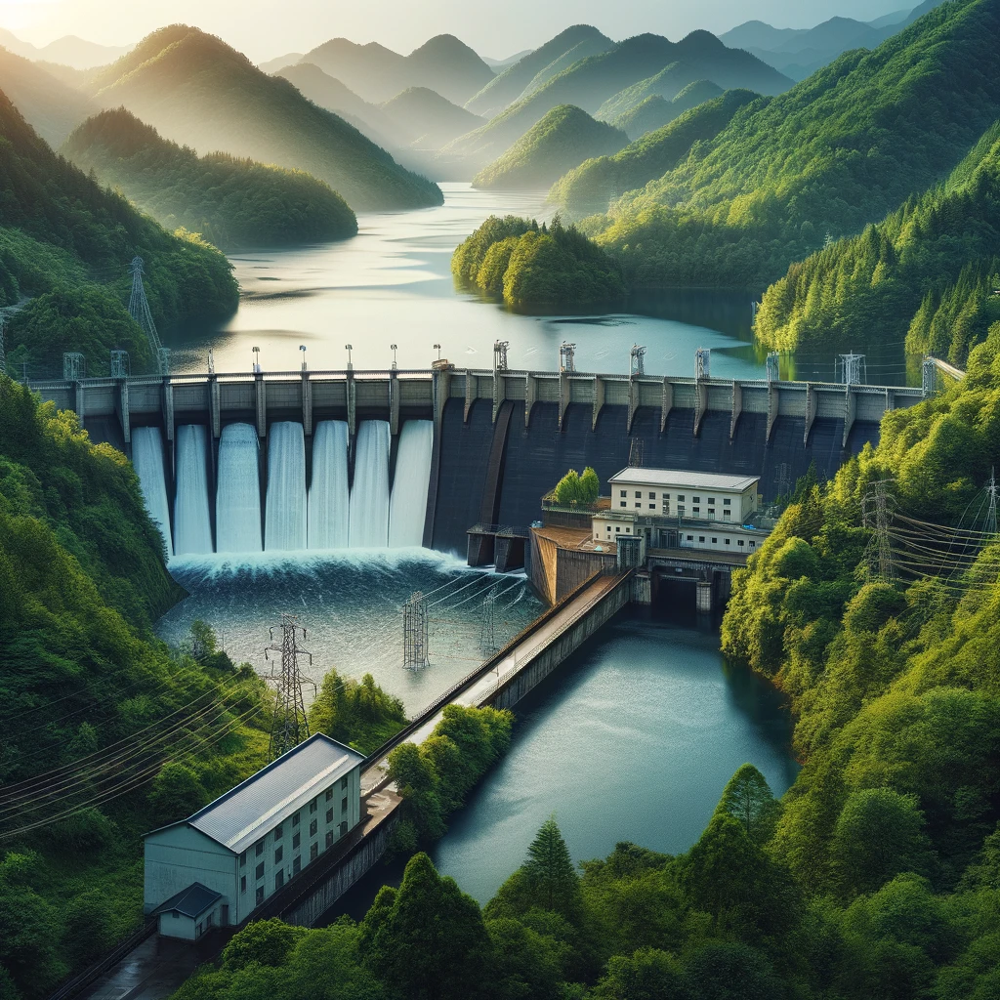
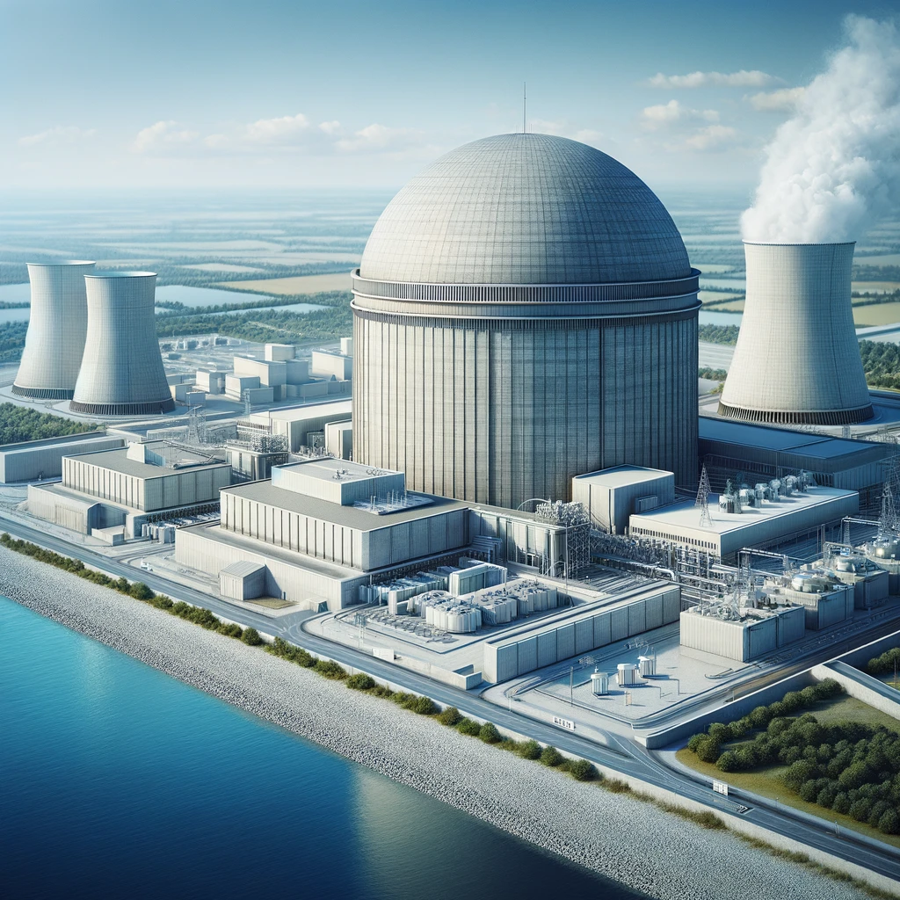
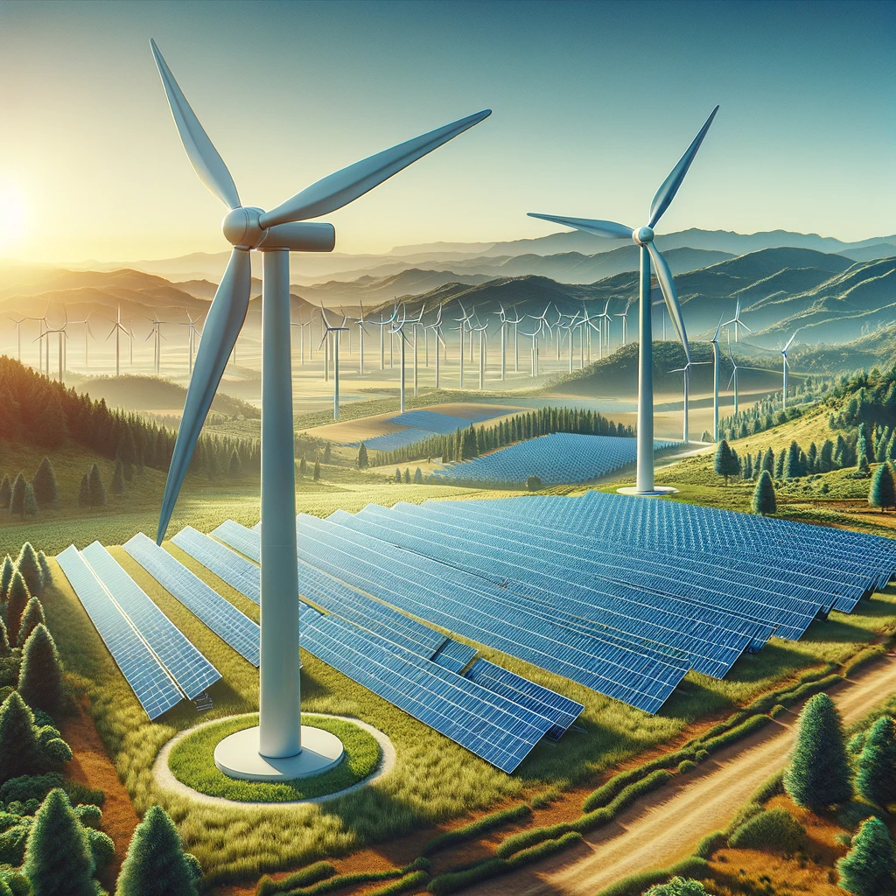
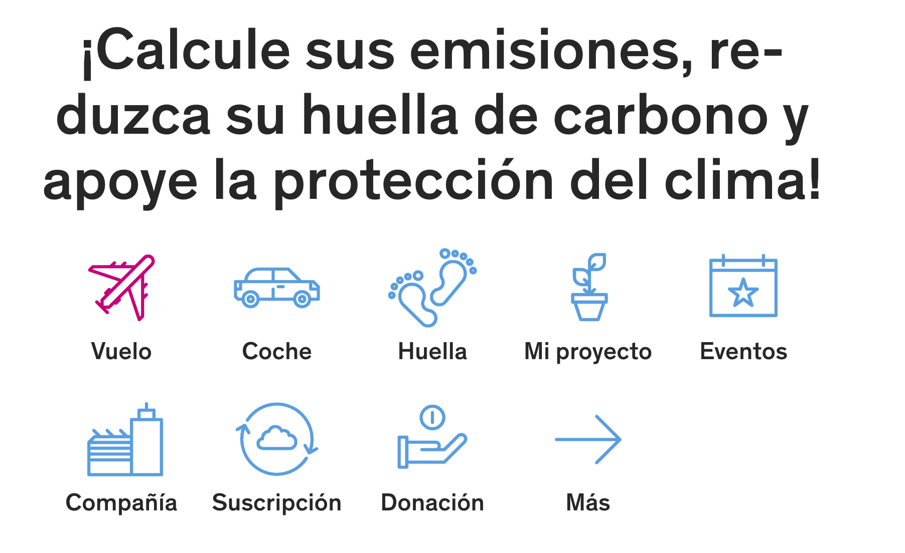

# El medio ambiente
## ¿Qué es el cambio climático?
El cambio climático se refiere a los cambios significativos y duraderos en los patrones climáticos y las temperaturas de la Tierra que ocurren a lo largo de varias décadas o más. A menudo, el término se utiliza específicamente para describir el calentamiento global causado por la actividad humana desde la era industrial, lo que incluye un aumento en la concentración de gases de efecto invernadero en la atmósfera.

### ¿Cómo se ha generado el cambio climático?
El cambio climático ha sido impulsado principalmente por la quema de combustibles fósiles como el carbón, el petróleo y el gas natural. Este proceso libera dióxido de carbono y otros gases de efecto invernadero, que atrapan el calor en la atmósfera terrestre, causando el fenómeno conocido como el efecto invernadero. Otras actividades humanas, como la deforestación y la agricultura industrial, también contribuyen significativamente a la acumulación de estos gases.

#### Forzamiento Radiativo
¿Has oído hablar del forzamiento radiativo? Es un concepto que mide la influencia que tiene un factor específico (como los gases de efecto invernadero) en la cantidad de energía que entra y sale de la atmósfera terrestre. En términos sencillos, es como medir cuánto influyen distintos factores en el “termostato” del planeta. Por ejemplo, cuando emitimos más dióxido de carbono, aumenta el forzamiento radiativo positivo, lo que significa que se acumula más calor en nuestro sistema climático.

#### Albedo
El albedo se refiere a la capacidad de las superficies de la Tierra para reflejar la luz solar. Superficies claras como los glaciares tienen un albedo alto porque reflejan gran parte de la luz solar. Pero cuando hablamos de deshielo, por ejemplo, áreas que antes eran blancas y reflectantes se convierten en oscuras y absorben más calor. Esto afecta el clima global, ya que al disminuir el albedo global, la Tierra absorbe más energía solar, y esto a su vez, calienta aún más el planeta.

#### Retroalimentaciones Climáticas
Esto nos lleva directamente a las retroalimentaciones climáticas. Son procesos que pueden amplificar o reducir los efectos del cambio climático inicial. Un ejemplo clásico es el deshielo del permafrost. El permafrost es el suelo permanentemente congelado en regiones muy frías. Al calentarse el clima, este permafrost se derrite y libera metano, un potente gas de efecto invernadero. Esto crea una retroalimentación positiva: más calor implica más deshielo y más metano liberado, lo que a su vez genera más calentamiento.

### ¿Cuáles son los principales factores hoy en día que incrementan el daño al planeta Tierra y generan más cambio climático?
Los principales factores que contribuyen al cambio climático incluyen:
- **La quema de combustibles fósiles:** Uso intensivo de carbón, petróleo y gas para energía, que libera grandes cantidades de CO2.
- **Deforestación:** La tala y quema de bosques disminuyen la capacidad del planeta para absorber CO2.
- **Agricultura:** La producción de metano por parte de la ganadería y el uso de fertilizantes nitrogenados que emiten óxidos de nitrógeno, ambos potentes gases de efecto invernadero.
- **Industrialización:** Emisiones industriales de gases y químicos que contribuyen tanto al efecto invernadero como a la contaminación atmosférica.

### Componentes Abióticos
Los componentes abióticos son elementos no vivos que juegan un papel crucial en los ecosistemas. Estos incluyen factores físicos y químicos como la temperatura, la luz solar, el pH del suelo y del agua, los nutrientes inorgánicos, el agua y el aire. Estos factores determinan las condiciones y límites dentro de los cuales los organismos vivos pueden sobrevivir y reproducirse.

**Temperatura:** Afecta directamente los metabolismos y la supervivencia de los seres vivos.
**Agua:** Esencial para todos los organismos, influye en procesos fisiológicos y en la distribución de las especies.
**Luz solar:** Fuente primaria de energía para la fotosíntesis, determina los ciclos de crecimiento y los patrones migratorios.
**Suelo y minerales:** Proporcionan los nutrientes esenciales que sustentan las cadenas tróficas.

### Componentes Bióticos
Los componentes bióticos comprenden todas las formas de vida en un ecosistema, desde microorganismos y plantas hasta animales y humanos. Estos componentes se organizan en diferentes niveles tróficos o cadenas alimenticias, que describen cómo la energía y los nutrientes fluyen desde los productores primarios (generalmente plantas y algas) hasta los consumidores (herbívoros, carnívoros) y descomponedores (bacterias y hongos).

**Productores:** Capturan la energía solar y la convierten en energía química a través de la fotosíntesis.
**Consumidores:** Se alimentan de los productores y entre sí, transfiriendo energía y nutrientes a través de los niveles tróficos.
**Descomponedores:** Reciclan nutrientes al descomponer materia orgánica muerta, devolviéndolos al ambiente para ser utilizados por los productores.

### Interacciones entre Componentes Bióticos y Abióticos
La interacción entre componentes bióticos y abióticos es fundamental para el mantenimiento y la estabilidad de los ecosistemas. Estas interacciones regulan los ciclos biogeoquímicos, como los ciclos del carbono, nitrógeno y oxígeno, que son esenciales para la vida en la Tierra.

- **Ciclos Biogeoquímicos:** Los nutrientes se mueven a través del ecosistema en ciclos cerrados, mediados por procesos físicos como la evaporación y químicos como la descomposición.
- **Redes Tróficas:** La interacción entre diferentes especies, incluyendo relaciones predador-presa y competencia, forma complejas redes tróficas que contribuyen a la diversidad y resiliencia del ecosistema.
- **Adaptaciones:** Los organismos desarrollan adaptaciones en respuesta a los factores abióticos, lo que puede llevar a la evolución de nuevas especies y cambiar la composición de la comunidad biótica.

#### Ciclos de vida en la tierra
##### Ciclo del Carbon
<iframe width="560" height="315" src="https://www.youtube.com/embed/jQFSCmSu5XM?si=vZnKK1Uk2MzIKg8l" title="YouTube video player" frameborder="0" allow="accelerometer; autoplay; clipboard-write; encrypted-media; gyroscope; picture-in-picture; web-share" referrerpolicy="strict-origin-when-cross-origin" allowfullscreen></iframe>

##### Ciclo del Nitrogeno
<iframe width="560" height="315" src="https://www.youtube.com/embed/wI4TT8aJuos?si=Aa7kSnJ11xF7ts0w" title="YouTube video player" frameborder="0" allow="accelerometer; autoplay; clipboard-write; encrypted-media; gyroscope; picture-in-picture; web-share" referrerpolicy="strict-origin-when-cross-origin" allowfullscreen></iframe>

##### Ciclo del Oxígeno
<iframe width="560" height="315" src="https://www.youtube.com/embed/DpwIw0SyQfE?si=mtNRpacY5bFaX29K" title="YouTube video player" frameborder="0" allow="accelerometer; autoplay; clipboard-write; encrypted-media; gyroscope; picture-in-picture; web-share" referrerpolicy="strict-origin-when-cross-origin" allowfullscreen></iframe>

### Ecosistema
Un ecosistema es una comunidad de seres vivos, como plantas, animales y microorganismos, que interactúan entre sí y con su entorno físico, como el suelo, el agua y el aire. Estas interacciones forman una red compleja que ayuda a mantener el equilibrio y el funcionamiento de la naturaleza. Los ecosistemas son esenciales porque proveen servicios vitales como la purificación del aire y el agua, la producción de oxígeno y la descomposición de residuos, todos cruciales para la supervivencia humana.

### Bioma
Un bioma es una gran área geográfica que presenta condiciones climáticas, flora y fauna similares. Ejemplos comunes incluyen los bosques tropicales, las sabanas y los desiertos. Cada bioma soporta formas de vida que están adaptadas a sus condiciones específicas. Estudiar los biomas es importante porque nos ayuda a entender cómo se distribuyen las diferentes especies en el planeta y cómo pueden afectar o ser afectadas por cambios globales, como el cambio climático.

### Antropocéntrico
El término antropocéntrico se refiere a una visión del mundo que coloca a los seres humanos en el centro del universo, considerando a otras formas de vida y al medio ambiente principalmente en términos de su utilidad para los humanos. Esta perspectiva puede llevar a políticas y prácticas que priorizan las necesidades humanas a corto plazo sobre la salud a largo plazo del planeta. Comprender y cuestionar el enfoque antropocéntrico es crucial para fomentar un mayor respeto y cuidado por el medio ambiente y todas sus formas de vida.

[Documental de Netflix: Romper los Límites](https://www.netflix.com/co/title/81336476s)

### Sustentabilidad
Sustentabilidad se refiere a la capacidad de satisfacer las necesidades del presente sin comprometer la capacidad de las futuras generaciones de satisfacer sus propias necesidades. Involucra encontrar un equilibrio entre el crecimiento económico, la conservación del medio ambiente y el bienestar social. Aprender sobre sustentabilidad es esencial porque nos enseña a utilizar los recursos de manera eficiente y a implementar tecnologías y prácticas que no dañen el planeta, asegurando un futuro sano y viable para todos.

## ¿Qué es el cambio climático?
El cambio climático se refiere a los cambios significativos y duraderos en los patrones climáticos y las temperaturas de la Tierra que ocurren a lo largo de varias décadas o más. A menudo, el término se utiliza específicamente para describir el calentamiento global causado por la actividad humana desde la era industrial, lo que incluye un aumento en la concentración de gases de efecto invernadero en la atmósfera.

### ¿Cómo se ha generado el cambio climático?
El cambio climático ha sido impulsado principalmente por la quema de combustibles fósiles como el carbón, el petróleo y el gas natural. Este proceso libera dióxido de carbono y otros gases de efecto invernadero, que atrapan el calor en la atmósfera terrestre, causando el fenómeno conocido como el efecto invernadero. Otras actividades humanas, como la deforestación y la agricultura industrial, también contribuyen significativamente a la acumulación de estos gases.

### ¿Cuáles son los principales factores hoy en día que incrementan el daño al planeta Tierra y generan más cambio climático?
Los principales factores que contribuyen al cambio climático incluyen:
- **La quema de combustibles fósiles:** Uso intensivo de carbón, petróleo y gas para energía, que libera grandes cantidades de CO2.
- **Deforestación:** La tala y quema de bosques disminuyen la capacidad del planeta para absorber CO2.
- **Agricultura:** La producción de metano por parte de la ganadería y el uso de fertilizantes nitrogenados que emiten óxidos de nitrógeno, ambos potentes gases de efecto invernadero.
- **Industrialización:** Emisiones industriales de gases y químicos que contribuyen tanto al efecto invernadero como a la contaminación atmosférica.

## ¿Se puede revertir el cambio climático?
Revertir completamente el cambio climático es extremadamente difícil debido a los gases ya emitidos y acumulados en la atmósfera; sin embargo, es posible mitigar sus efectos y limitar el calentamiento futuro mediante la reducción de emisiones, la captura de carbono y la adaptación a los cambios climáticos inevitables. Esto requiere una acción global coordinada y el compromiso a largo plazo de todos los sectores de la sociedad.

## ¿Mediante qué acciones podemos aportar a tener un mejor medio ambiente?
Desde pequeñas acciones hasta grandes trabajos, existen muchas formas de contribuir a un medio ambiente más sano y mitigar el cambio climático:

- **A nivel individual:** Reducir el consumo de energía, utilizar transporte público o bicicletas, reciclar, y apoyar productos sostenibles.
- **En la comunidad:** Participar en o iniciar programas de reforestación, educación ambiental y reciclaje comunitario.
- **A nivel empresarial:** Implementar prácticas de producción sostenible, mejorar la eficiencia energética y desarrollar tecnologías limpias.
Cada acción cuenta y puede contribuir significativamente a reducir el impacto humano en el planeta y fomentar un futuro más sostenible.

<iframe width="560" height="315" src="https://www.youtube.com/embed/LyK3F7PLzAg?si=90jJkXaHWM2N-3RR" title="YouTube video player" frameborder="0" allow="accelerometer; autoplay; clipboard-write; encrypted-media; gyroscope; picture-in-picture; web-share" referrerpolicy="strict-origin-when-cross-origin" allowfullscreen></iframe>

### Reforestación: Mundo del arbol
Los árboles absorben dióxido de carbono (CO2), uno de los principales gases de efecto invernadero, durante el proceso de fotosíntesis para crecer y desarrollarse. Al hacerlo, capturan y almacenan carbono que de otro modo estaría en la atmósfera, contribuyendo al efecto invernadero. A medida que los árboles crecen, acumulan carbono en su biomasa (troncos, ramas, hojas y raíces), lo que reduce la cantidad de CO2 en la atmósfera.

**Conservación de la Biodiversidad**
Los árboles y los bosques son hábitats vitales para muchas especies de fauna y flora, lo que promueve la biodiversidad. La biodiversidad es crucial para la resiliencia ecológica, lo cual es importante para la adaptación al cambio climático. Un ecosistema diverso tiene una mayor capacidad para adaptarse a las condiciones cambiantes y para mantener funciones ecosistémicas esenciales como la polinización, la purificación del agua y la regulación del clima.

**Reducción de la Erosión del Suelo y Mejora de la Calidad del Agua**
Los árboles ayudan a estabilizar el suelo y reducir la erosión mediante sus sistemas de raíces, que mantienen el suelo en su lugar. Además, los bosques pueden mejorar la calidad del agua al filtrar los contaminantes y reducir el escurrimiento superficial, lo que a su vez protege los ecosistemas acuáticos.

**Modificación del Microclima Local**
Los árboles pueden modificar el microclima local a través de la sombra y la transpiración. La sombra de los árboles reduce la temperatura del suelo y del aire circundante, lo que puede ayudar a combatir el efecto de "isla de calor" en áreas urbanas. La transpiración libera vapor de agua al aire, lo cual puede contribuir a la refrigeración del aire ambiente.

**Desarrollo Sostenible**
Las iniciativas de reforestación pueden ofrecer oportunidades económicas a través del manejo sostenible de los recursos forestales, incluyendo madera, frutas, y otros productos no maderables. Esto puede proporcionar incentivos económicos para la conservación de los bosques y para las prácticas de uso del suelo que son más favorables para el clima.

**Limitaciones y Consideraciones**
Aunque la reforestación tiene muchos beneficios potenciales para combatir el cambio climático, también hay limitaciones y riesgos que deben considerarse, como la competencia por el uso del suelo con la agricultura y la posibilidad de que los monocultivos de árboles puedan reducir la biodiversidad local. Además, es fundamental elegir especies de árboles adecuadas para el clima y el suelo local para asegurar el éxito a largo plazo de las iniciativas de reforestación.

## Organización Social

Recordemos que las centrales termicas de combustibles Fósiles contaminan principalmente dióxido de carbono (CO2) que contribuye al cambio climático. Socialmente como ciudad debemos pensar en alternativas como Centrales Hidroeléctricas, Centrales Nucleares, Centrales de Energía Renovable.

### Centrales Térmicas de Combustibles Fósiles
Las centrales que queman carbón, petróleo o gas natural son grandes contribuyentes a varios tipos de contaminación:

Central termica de combustión Fósil

- **Gases de efecto invernadero:** Principalmente dióxido de carbono (CO2), que es un contribuyente significativo al cambio climático.
- **Partículas y cenizas:** La combustión de combustibles fósiles libera partículas finas que pueden causar problemas respiratorios y otras enfermedades.
- **Óxidos de nitrógeno (NOx) y óxidos de azufre (SOx):** Estos gases pueden formar smog y lluvia ácida, afectando la salud humana, dañando edificios, monumentos y deteriorando ecosistemas acuáticos y terrestres.
- **Metales pesados:** Como mercurio, plomo y cadmio, que son tóxicos para la vida acuática y humana.

### Centrales Hidroeléctricas
Aunque son mucho menos contaminantes en términos de emisiones al aire, las centrales hidroeléctricas pueden tener impactos ambientales significativos:

Central Hidroelectrica

- **Alteración de ecosistemas:** Pueden alterar los hábitats acuáticos y terrestres locales, afectando la biodiversidad.
- **Erosión y sedimentación:** La construcción y operación de represas puede llevar a problemas de erosión y alterar los patrones de sedimentación río abajo.

### Centrales Nucleares
Las centrales nucleares no emiten CO2 durante la generación de energía, pero presentan otros riesgos y contaminantes:

Central de Energía Nuclear

- **Residuos radiactivos:** Generan residuos que pueden permanecer radiactivos y peligrosos durante miles de años y deben ser manejados y almacenados con extremo cuidado.
- **Contaminación térmica:** El agua utilizada para enfriar el reactor puede ser devuelta a su fuente a una temperatura más alta, afectando la vida acuática.

### Centrales de Energía Renovable
Las centrales de energía solar y eólica tienen un impacto ambiental mucho menor en comparación con las fuentes de energía convencionales. Sin embargo, también tienen algunos efectos:

Central de Energía Renovable

- **Impacto visual y uso del suelo:** Especialmente en el caso de las granjas eólicas y los grandes parques solares.
- **Producción y desecho de materiales:** La fabricación y eventual disposición de paneles solares y turbinas eólicas implican el uso y manejo de materiales que podrían ser tóxicos o contaminantes si no se manejan correctamente.

## ¿Qué es la huella de carbono?
La huella de carbono es una medida del impacto total de las emisiones de gases de efecto invernadero causadas directa o indirectamente por una actividad o acumuladas durante la vida de un producto. Se mide en unidades de dióxido de carbono equivalente (CO2e) y refleja la suma de todos los gases de efecto invernadero emitidos, convertidos a su equivalente de CO2 en términos de su potencial de calentamiento global.

**Calculadoras en línea:** Invitamos al lector a calcular la huella de carbono en MyClimate donde se ofrece calculadoras donde puedes ingresar información sobre tu estilo de vida o actividades empresariales para obtener una estimación de tu huella de carbono. [Calcula tu huella de carbono](https://www.myclimate.org/en/)

Utiliza el traductor del navegador para responder las preguntas realizadas y hacer la conversión adecuada de Euros a Pesos Colombianos.

Otra alternativa para el calculo de huella de carbono la encontramos en ClimateTrade [Calcula tu huella de carbono en ClimateTrade](https://market.climatetrade.com/carbon-footprint-calculator/es). Se recomienda estar en un espacio donde tenga la disponibilidad de datos de consumo de energía electrica

 

 Calcular nuestra huella de carbono aumenta nuestra conciencia sobre como las actividades diarias contribuyen a la emision de gases de efecto invernadero y esto nos puede generar pequeñas acciones sostenibles que ayuden al mundo.

 ### Huella Hídrica
La huella hídrica mide la cantidad total de agua dulce utilizada para producir los bienes y servicios consumidos por un individuo, comunidad, empresa o país. Incluye agua usada directa e indirectamente a lo largo de toda la cadena de suministro. Por ejemplo, la huella hídrica de un producto agrícola no solo considera el agua usada en el riego, sino también la utilizada en la producción de los insumos agrícolas como fertilizantes o en el procesamiento y transporte del producto final. Comprender y gestionar la huella hídrica es crucial para la conservación del agua, especialmente en áreas propensas a la sequía o donde los recursos hídricos son limitados.

 ## ¿Qué es la biodiversidad?
La biodiversidad se refiere a la variedad y variabilidad de formas de vida en la Tierra, incluyendo la diversidad genética, de especies y de ecosistemas. Es fundamental para la resiliencia de los ecosistemas y para proporcionar servicios ecosistémicos esenciales que sustentan la vida, como la purificación del agua, la polinización de plantas y la regulación del clima.

### Diversidad Genética
Primero, hablemos de la diversidad genética, que es la variabilidad de genes dentro de una especie. Esto es lo que hace que tú y yo, aunque seamos ambos humanos, seamos únicos. Esta diversidad genética es esencial para la adaptación y supervivencia de las especies frente a cambios en el medio ambiente. Por ejemplo, en una población de plantas, aquellas con genes que les permiten resistir sequías severas tienen más probabilidades de sobrevivir y reproducirse bajo condiciones climáticas extremas. Esta capacidad de adaptación es vital para la resiliencia del ecosistema.

### Especies Endémicas y Hotspots de Biodiversidad
Ahora, piensa en las especies endémicas, aquellas que solo se encuentran en una ubicación particular y en ningún otro lugar del mundo. Las Islas Galápagos son un ejemplo clásico, con criaturas como las famosas tortugas gigantes. Los lugares que tienen una alta concentración de estas especies únicas se conocen como hotspots de biodiversidad. Estas áreas son críticas porque albergan una gran cantidad de biodiversidad en comparación con otros lugares del mundo, pero también son muy vulnerables a la extinción.

### Especiación y Extinción
La especiación es el proceso a través del cual nuevas especies evolucionan a partir de una especie ancestral. Este proceso puede tomar millones de años y usualmente es impulsado por la separación geográfica o adaptaciones a nichos ecológicos únicos. Por otro lado, la extinción es el final del camino para una especie. Aunque la extinción es un proceso natural, las actividades humanas han acelerado este ritmo a un nivel alarmante, lo que afecta negativamente la salud de los ecosistemas globales.

### Practicas de bioconservación
Las prácticas de conservación pueden variar ampliamente, pero aquí hay algunas ideas generales:

**Conservación de agua:** Implementar sistemas de recolección de agua de lluvia y tecnologías de riego eficiente.
**Protección de hábitats:** Establecer áreas protegidas o reservas para preservar hábitats críticos.
**Restauración ecológica:** Rehabilitar áreas que han sido degradadas o dañadas por actividades humanas, como la reforestación de áreas deforestadas o la restauración de humedales.
**Manejo sostenible de recursos:** Utilizar métodos de agricultura y silvicultura que minimicen el impacto ambiental.
**Educación y concienciación:** Programas de educación para enseñar a la comunidad sobre la importancia de la biodiversidad y cómo protegerla.
**Legislación y regulación:** Fortalecer las leyes de protección ambiental y asegurar su cumplimiento para proteger las especies en peligro y sus hábitats.

### Porque debemos conservar la Biodiversidad
**Servicios ecosistémicos:** La biodiversidad es fundamental para servicios como la purificación del agua, la polinización de cultivos y plantas, el control de inundaciones y la protección contra tormentas. Estos servicios benefician directamente al bienestar humano y a la economía.
**Seguridad alimentaria:** La diversidad de especies asegura una variedad de alimentos, lo que contribuye a dietas nutritivas y a la seguridad alimentaria.
**Salud:** Los ecosistemas saludables pueden ayudar a regular enfermedades al controlar las poblaciones de especies que podrían convertirse en vectores de enfermedades. Además, muchos medicamentos son derivados de compuestos encontrados en animales y plantas.
**Resiliencia ecológica:** Una alta biodiversidad aumenta la resiliencia de los ecosistemas frente a perturbaciones como el cambio climático, ayudando a mantener el equilibrio ecológico.
**Cultural y recreativo:** La biodiversidad enriquece las culturas, proporciona inspiración y contribuye al bienestar mental a través de actividades recreativas como el senderismo, la observación de aves y otras formas de ecoturismo.

## Tecnologías y prácticas sostenibles
### Captura y almacenamiento de carbono
La captura y almacenamiento de carbono (CAC), también conocida como secuestro de carbono, es una tecnología diseñada para reducir las emisiones de dióxido de carbono (CO2) en la atmósfera, lo cual es crucial para combatir el cambio climático. Aquí te explico cómo funciona y por qué es importante.
Podemos capturar el CO2 producido por fuentes industríales y energeticas, como plantas de energia que queman combustibles fósiles
### Gestión de Residuos Sostenible
La gestión de residuos sostenible implica prácticas y estrategias destinadas a reducir el volumen y la toxicidad de los desechos generados, mejorar los procesos para la recolección, manejo y disposición de residuos, y maximizar la recuperación de recursos a través del reciclaje y la reutilización. El objetivo es minimizar el impacto ambiental de los residuos, promoviendo una economía circular donde los materiales se mantienen en uso durante el mayor tiempo posible y la generación de residuos se reduce al mínimo. Esto no solo ayuda a preservar los recursos naturales, sino que también reduce la contaminación y mejora la eficiencia en el uso de materiales.

### Energía Solar de Perovskita:
Las células solares de perovskita son una tecnología emergente que promete revolucionar la captación de energía solar debido a su bajo costo y alta eficiencia. Estas células pueden fabricarse con métodos de procesamiento en solución más simples comparados con las tradicionales células de silicio.
### Aerogeneradores Flotantes:
Los aerogeneradores flotantes permiten la instalación de parques eólicos marinos en aguas profundas donde no es viable el montaje de estructuras fijas. Esto amplía enormemente el potencial de generación de energía eólica, aprovechando vientos más fuertes y constantes en el mar.
### Paneles Solares Orgánicos y Flexibles:
Los paneles solares orgánicos (OPV) ofrecen flexibilidad y una fabricación más sostenible. Pueden integrarse en materiales de construcción o vehículos, abriendo nuevas vías para la generación de energía solar en entornos urbanos.